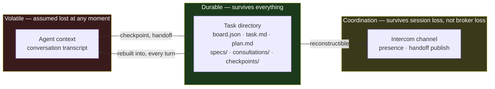
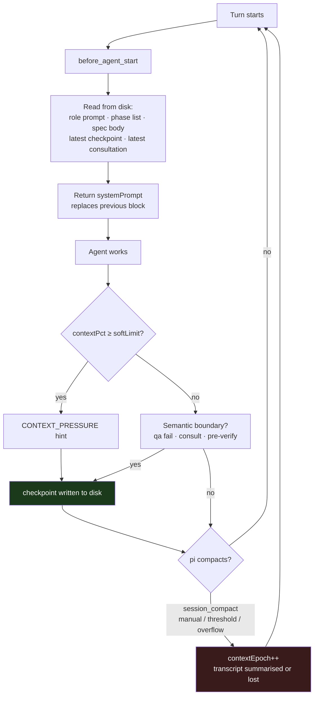
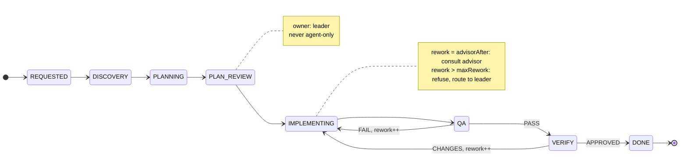
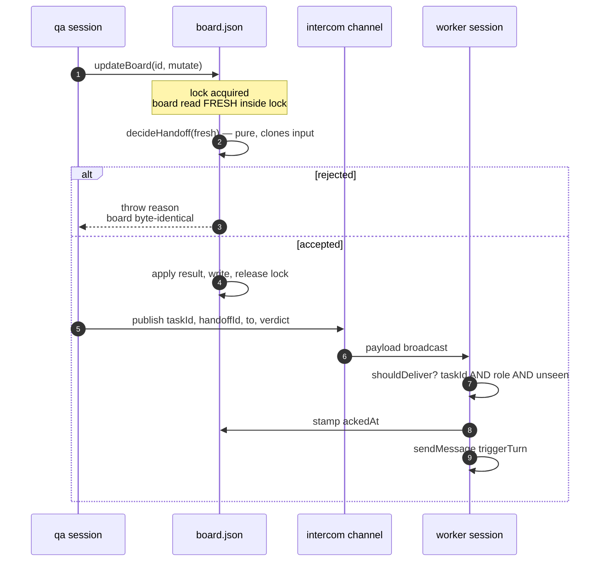

# pi-blanche: durable multi-agent tasks over ephemeral LLM contexts

**Version 0.1.0 · pi 0.84.2 · herdr 0.8.2**

## Abstract

A coding task frequently outlives the context window of any single agent
session working on it. Conventional mitigations — larger windows, summarising
compaction — reduce the frequency of loss without changing its character: the
information is still held in a conversation transcript, and a transcript is a
lossy, unaddressable store.

pi-blanche inverts the relationship. The task is the durable object, persisted
as files on disk; agent contexts are treated as *disposable, replaceable
workers* over that object. A context that is compacted, crashed, or deliberately
destroyed is not a loss event, because it held no authoritative state.

This document specifies three coupled mechanisms:

1. **L-Thread** (§3) — a logical thread of work spanning many physical contexts,
   segmented into *epochs* and made resumable by *checkpoints*.
2. **Compaction interaction** (§4) — why the system deliberately does *not* own
   compaction, and how ordering guarantees are obtained without doing so.
3. **Crew** (§5) — a coordination protocol under which several specialised
   agents advance one task, with a single serialisable source of truth.

We state the invariants each mechanism maintains, the evidence for the runtime
assumptions they rest on, and the conditions under which they fail.

---

## 1. Problem statement

Let a *task* T require work W(T) whose transcript length exceeds the usable
context of a single agent session S. Three properties are desirable:

- **P1 — Durability.** Progress on T survives the destruction of any S.
- **P2 — Continuity.** A replacement session S′ resumes without rediscovering
  what S already established, including negative results.
- **P3 — Division of labour.** Distinct sub-problems of T may be assigned to
  differently-capable agents without losing a coherent view of T.

Summarising compaction addresses P2 only partially and P1 not at all. It is
lossy by construction and, critically, *unpredictably* lossy: the operator
cannot state in advance which facts survive. Empirically the highest-value
facts — failed approaches, and the reasons they failed — are precisely those a
summariser discards as unproductive.

### 1.1 Design principles

> **Use expensive intelligence to decide; use cheap agents to execute; escalate
> instead of making every agent expensive.**

> **Long-lived tasks, short-lived contexts.**

The first governs §5, the second §3.

---

## 2. System model

### 2.1 Entities

| Symbol | Entity | Lifetime |
|---|---|---|
| T | Task | days; bounded by explicit deletion |
| B | Board — authoritative runtime state of T | = T |
| R | Role (leader, planner, researcher, advisor, worker, qa, verifier) | = T |
| S | Session — one OS process running one pi agent for one R | minutes–hours |
| E | Epoch — a maximal interval of S between compactions | minutes |
| C | Checkpoint — durable continuation state written by R at epoch or semantic boundary | = T |

A role R is *realised* by a sequence of sessions S₁…Sₙ, each of which passes
through epochs E₁…Eₘ. Neither S nor E is authoritative for any fact about T.

### 2.2 State partition

All state is exactly one of:

- **Durable** — the task directory. Survives everything.
- **Coordination** — the intercom extension channel. Survives session loss,
  not broker loss; reconstructible from durable state.
- **Volatile** — the contents of any agent context. Assumed lost at any moment.

The central invariant follows directly:

> **I1 (Durability).** No fact required to continue T is stored only in volatile
> state.

The operational test for I1, applied as an acceptance criterion:

> *If every pi transcript were deleted right now, could `/crew resume`
> reconstruct enough truth for each role to continue correctly?*



Arrows into the durable layer are the only ones that persist information;
everything flowing outward is a projection that may be destroyed at any time.

### 2.3 Task directory

```
~/.pi/agent/pi-blanche/tasks/<id>/
  board.json        runtime state; references, never long-form content
  task.md           original requirement and constraints
  plan.md           approved plan
  specs/            small, independently verifiable units of work
  consultations/    distilled advisor conclusions
  checkpoints/      per-role, per-epoch continuation state
```

`board.json` holds references rather than content so that the serialisable
critical section (§6) stays small and cheap to rewrite.

---

## 3. L-Thread

### 3.1 Definition

An **L-Thread** is the logical thread of work for one role R on one task T,
spanning the sequence of epochs E₁…Eₘ across all sessions realising R.

Continuity across an epoch boundary is *not* provided by conversation history.
It is provided by reconstruction: at every turn, the system re-derives what R
needs to know from durable state and injects it.

### 3.2 Reconstruction, not retention

On each turn, if `BLANCHE_ROLE` and `BLANCHE_TASK` are set, the extension
assembles a block containing:

1. the role prompt for R;
2. the workflow's phase sequence, with the current phase and each phase's owner;
3. the board summary — task, phase, owner, current spec, rework round, epoch;
4. the body of the current spec;
5. **the latest checkpoint for (R, current spec)**;
6. the latest advisor consultation for the current spec;
7. peer session names;
8. a context-pressure hint, if applicable (§4.3).

Items 1–7 are read from disk on every turn. `buildCrewBlock` itself is a pure
function of its arguments: all file content arrives as parameters and the
renderer performs no I/O. This makes the assembly independently testable and
keeps the read policy in one place.

The resulting cycle — and the epoch boundary it survives — is:



The epoch boundary (red) has no handler. Because step C runs on *every* turn,
the first turn of the new epoch is briefed identically to any other turn — from
disk, including the checkpoint written at step I (green).

### 3.3 Ephemerality of the injected block

The block is returned as `{ systemPrompt }` from `before_agent_start`. This is
load-bearing and rests on a verified property of the host:

> pi stores an extension-returned system prompt in `_systemPromptOverride`
> (`agent-session.js:902`) and **resets it to `undefined` on any turn where no
> extension returns one** (`agent-session.js:907`). It is never appended to the
> message history.

**Consequence.** The block is replaced, not accumulated. A session that has run
200 turns carries exactly one copy, always current. Had the block been delivered
as a message, each turn would append a stale copy, and the mechanism intended to
survive compaction would itself become the dominant consumer of context.

> **I2 (Freshness).** The phase, spec and checkpoint an agent reads are those
> current at the start of its turn.

### 3.4 Checkpoints

```ts
checkpoint({ completed, decisions, failedApproaches, currentFailures,
             validation, filesChanged, remaining, nextAction })
```

Written to `checkpoints/{spec|task}-{role}-e{epoch}.md`, merging the agent's
structured facts with what the board already knows.

The schema is deliberately asymmetric with respect to outcome. `failedApproaches`
and `currentFailures` are the highest-value fields, because a negative result is
expensive to obtain and cheap to lose:

> *"Redis lock around the controller; the race happens before the lock is
> acquired."*

A summariser discards this as unproductive. A successor without it re-derives it
at full cost. By contrast, raw tool output, successful command logs and
superseded diffs are deliberately **not** captured: they are cheap to regenerate
and would dilute the record.

`validation` records what has actually been proven — *"targeted spec passes,
full suite not run"* — separating demonstrated from assumed correctness across
the boundary.

### 3.5 Checkpoint boundaries

Checkpoints are triggered by *semantic* events, not solely by context pressure:
after plan approval, before handing to qa, after every qa failure, after an
advisor consultation, before verification, and after any substantial subtask.
Context pressure (§4.3) is an additional, best-effort trigger.

The reason is stated plainly: a purely pressure-driven policy checkpoints when
the context is nearly exhausted, which is both the least reliable moment to
demand structured output and not necessarily a moment at which the work is in a
coherent state.

---

## 4. Compaction

### 4.1 Non-ownership

pi-blanche does not implement, trigger, or schedule compaction. This is a
deliberate rejection of a larger design that would have added context tracking,
dual thresholds, extension-triggered compaction, epoch rotation and advisor-
validated distillation.

Justification, in the order the alternatives were eliminated:

1. **Context pressure is already measured.** pi-intercom publishes
   `contextPct`/`contextTokens` on every session's presence record. Re-deriving
   it would duplicate a value the roster already carries.
2. **Compaction is already implemented.** pi compacts at its own threshold and
   emits an event. A second scheduler would race the first.
3. **Rehydration is already implemented — by §3.2.** Because the block is
   rebuilt every turn, a session that has just compacted is re-briefed on its
   next turn with no additional machinery. *The epoch boundary requires no
   handler.*

What remains after this elimination is small: a `checkpoint` tool, and injecting
the latest checkpoint. Everything else was already present in the host or in a
mechanism built for another purpose.

### 4.2 Epoch accounting

`contextEpoch` for (R, S) is incremented on pi's `session_compact` event. The
event is emitted **after** compaction completes, at two call sites
(`agent-session.js:1441`, `:1679`), and carries
`reason: "manual" | "threshold" | "overflow"` (`extensions/types.d.ts:448`).

All three reasons increment the epoch. Manual `/compact`, threshold-triggered
compaction and overflow recovery are indistinguishable from the L-Thread's
perspective: each terminates an epoch.

### 4.3 The ordering argument

The requirement is not that a checkpoint exists at all times, but that one
exists *before* the epoch ends.

The system sets `context.softLimit` (default `0.65`) **below** pi's own
auto-compaction threshold. When a session's `contextPct` from the roster meets
or exceeds `softLimit`, the injected block gains:

```
CONTEXT_PRESSURE — finish this step, then call checkpoint().
```

Since the hint fires strictly before pi's threshold, an agent that complies
checkpoints before compaction occurs. Combined with the semantic boundaries of
§3.5, a recent checkpoint normally exists at every epoch boundary.

**This is a best-effort guarantee, and is stated as such.** The hint is advisory;
an agent may ignore it, and `overflow`-triggered compaction can occur without
the threshold being crossed in an observable way. Semantic boundaries, not the
soft limit, are the primary mechanism. An earlier draft claimed a checkpoint
"always exists before pi compacts"; that claim was withdrawn as unprovable.

---

## 5. Crew

### 5.1 Roles and capability allocation

Reasoning budget is allocated to *decisions*, not uniformly:

| Role | Thinking | Function |
|---|---|---|
| leader | (operator) | requirement, plan review, architecture, final escalation |
| planner | high | decomposition into independently verifiable specs |
| researcher | medium | gathers facts; read-only; never advances a phase |
| advisor | xhigh | reasons about *why* attempts failed; never implements |
| worker | low | executes one approved spec |
| qa | low | authors tests; runs validation; returns `PASS｜FAIL` |
| verifier | high | architecture, security, data integrity; `APPROVED｜CHANGES` |

The separation of **researcher** (retrieval) from **advisor** (inference) is
load-bearing. Conflating them forces one expensive agent to perform cheap
lookups, or one cheap agent to perform expensive reasoning. Both are addressed
by ordinary messages rather than handoffs, and neither owns a phase — so
consultation never moves the task.

### 5.2 Workflows as task shapes

Seven workflows (`quick`, `fix`, `hotfix`, `feat`, `refactor`, `investigate`,
`review`) each declare a roster and an ordered phase list with an owner per
phase.

A separate risk dimension was considered and rejected. A workflow *is* a task
shape and carries the ceremony that shape requires; a "high-risk `quick`" is
simply a `fix`. An orthogonal risk axis produced incoherent combinations — a
roster containing a planner for a workflow with no planning phase — and its
repair required a phase-composition language, which is a larger construct than
the seven presets it would generalise.

The `feat` workflow, which exercises every construct:



Ownership per phase is configuration, not code: `owner` is read from the
workflow, so `TARGETED_QA` and `REGRESSION_QA` need no special handling
anywhere in the protocol. The two notes mark the only points where the loop is
interrupted — one by the operator, one by the bound.

### 5.3 Handoff protocol

A handoff is the only operation that advances the task. It is decomposed into a
pure decision and an effectful commit:

```ts
decideHandoff(input: HandoffInput): HandoffDecision   // pure
```

`decideHandoff` performs no I/O and reads no clock: `now` and `handoffId` are
supplied by the caller. It `structuredClone`s the input board and returns a new
one, leaving its argument untouched.

Decision order:

1. **Resolve target.** `leader` resolves to the persisted leader session;
   otherwise `sessions[to]`. Not in roster → reject, listing the roster.
2. **Liveness.** Target absent from the live roster → reject. The board is never
   permitted to name an owner that cannot receive.
3. **Verdict validation.** `qa` ⊢ `PASS|FAIL`; `verifier` ⊢ `APPROVED|CHANGES`;
   all others ⊢ ∅. Schema validation, not workflow enforcement.
4. **Rework accounting.** `verdict ∈ {FAIL, CHANGES} ∧ to = worker` increments
   the rework counter — per spec when the workflow is spec-driven, else per
   board. No phase-name matching is used, so `TARGETED_QA` and `REGRESSION_QA`
   require no special case.
5. **Advisor escalation.** If `reworkRound ≥ advisorAfter` and
   `lastAdvisorConsultedRound < reworkRound`, attach a directive to consult the
   advisor. It re-fires every qualifying round until a consultation lands.
6. **Rework bound.** `reworkRound > maxRework` → reject, routing to the leader.
7. **Checkpoint warning.** No checkpoint for the sender's current epoch →
   attach a warning. Never blocks.
8. **Transition.** `phase ← input.phase`; `owner ← phaseOwner(phase) ?? to`;
   `currentSpec ← input.spec ?? currentSpec`; append a `HandoffRecord` with
   `ackedAt` unset.

> **I3 (Rejection immutability).** A rejected handoff leaves the board
> byte-identical.

### 5.4 Delivery and acknowledgement

Commit precedes publication. The decision is computed *inside* the serialised
mutation (§6) against a freshly-read board, committed, and only then published
on the coordination channel. Publishing first would allow a receiver to act on a
handoff that never committed.

The receiver's decision is likewise pure and total:

```ts
shouldDeliver({ payload, myTaskId, myRole, seenHandoffIds }): boolean
```

Delivery requires all three of: `taskId` match, `to` = own role, and
`handoffId` unseen. Each is necessary — the channel is broadcast, concurrent
tasks coexist, and `resume` deliberately republishes unacknowledged handoffs, so
a legitimate duplicate must be suppressed rather than double-delivered.



The ordering in steps 5–6 is deliberate: the commit completes before the
publish. Publishing first would let a receiver act on a handoff that never
committed. Step 8 is what makes an undelivered handoff observable rather than
silent.

On delivery the receiver stamps `ackedAt` and injects the message as a real turn.
An unacknowledged record is therefore an observable, recoverable condition rather
than a silent loss.

### 5.5 Escalation as a bounded loop

The worker/qa cycle is the only cycle in the protocol, and it is bounded twice:

- at `advisorAfter`, the worker is directed to stop, checkpoint, and consult;
- at `maxRework`, the handoff is refused and routed to the leader.

The refusal at `maxRework` is **the only enforcement in the system**. Everything
else — phases, ownership, sequence — is advisory. This asymmetry is intentional:
an unbounded retry loop between two automated agents consumes budget without
converging, which is the one failure the system is not willing to leave to
judgement.

#### 5.5.1 Attribution

A verdict caused entirely by files outside the spec's write scope is `BLOCKED`,
not `FAIL`, and must not increment the counter.

This rule was derived empirically. A repository-wide verification gate produced a
failing verdict against an agent whose own scope was clean; had that counted, the
agent would have been escalated and eventually refused for another agent's
defect. **Counters that drive escalation must be attributable to the unit under
review.**

---

## 6. Concurrency and consistency

### 6.1 The board is the only mutable shared resource

Several OS processes mutate `board.json` concurrently: a sender committing a
handoff, a receiver stamping `ackedAt`, a worker recording a checkpoint, any
session incrementing its epoch on compaction. These are not causally ordered.

### 6.2 Serialised read-modify-write

All mutation is funnelled through one primitive:

```ts
updateBoard(id: string, mutate: (b: Board) => void): Board
```

It acquires a lock, **reads inside the lock**, applies the mutation, writes, and
releases in a `finally`. `writeBoard` is not exported for general use.

Three properties are deliberate:

1. **Reading inside the lock** is what prevents the lost update. Mutual exclusion
   around a mutation of a value read *earlier* still writes stale data.
2. **No caller supplies an expected revision**, so no caller can supply a stale
   one. An earlier compare-and-set primitive required each call site to pass the
   correct revision; that discipline failed in practice, and the failure was
   silent. Making the correct operation the *only* operation removed the class.
3. **The retry catch is narrow.** Only the lock acquisition (`mkdirSync`, which
   fails `EEXIST` when held) is retried. Errors from the read, the mutation, or
   the write propagate unchanged. An earlier broad catch swallowed a legitimate
   handoff rejection thrown from inside the mutation, retried it twenty times,
   and reported it as lock contention — destroying the real reason.

Writes are atomic: content is written to a temporary file and renamed.

### 6.3 Known ceiling

Lock acquisition uses `mkdirSync`, with a stale lock older than 5 s broken so a
crashed holder cannot wedge the task permanently.

> **Ceiling.** The stale-break itself races. Two processes that both observe the
> same stale lock can both remove it and both acquire. This requires a crash
> *and* simultaneous recovery, and is accepted for v1. Upgrade path: an `O_EXCL`
> lock file carrying the owner's pid, verified before breaking.

This is recorded in the source at the point of the compromise, not only here.

---

## 7. Failure modes

| Condition | Detection | Response |
|---|---|---|
| Target session gone | liveness check pre-commit | reject; board never names an unreachable owner |
| Published, never injected | `ackedAt` absent | reported by `status`; `resume` republishes |
| Duplicate delivery | `handoffId` in seen set | suppressed |
| Broker unavailable | connection failure | kickoff refuses rather than spawning a mute crew |
| Concurrent commits | lock | serialised; no lost update |
| Crashed lock holder | mtime > 5 s | broken (see §6.3) |
| Non-converging worker | rework counter | advisor directive, then refusal to leader |
| Context exhaustion | roster `contextPct` ≥ softLimit | checkpoint hint; epoch rotates; §3.2 rehydrates |
| Config changed mid-task | persisted `resolved` snapshot | replayed verbatim; drift recorded, not acted on |
| Operator restart | — | `resume` respawns missing roles from the snapshot |

---

## 8. Verification status

**Proven.** 51 automated tests over: workflow and roster resolution; verdict
validation; per-spec rework accounting and advisor-nudge conditions; handoff
routing including the leader destination; rejection immutability; acknowledgement
de-duplication; successful-handoff persistence asserted by re-reading the board
*from disk*; serialised mutation; prompt assembly purity and stability; and
argument quoting for process spawning. Lint, type-check and a loadability guard
run in CI.

**Proven by harness.** Pane lifecycle is exercised against a stub implementing
the real herdr response envelopes, asserting that the pane identifier is
extracted from `result.pane.pane_id` and that cleanup closes the pane it opened.

**Not proven.** A live kickoff against real panes: real pane creation, a spawned
agent registering on the broker, and a handoff moving an actual turn between two
sessions. A headless harness cannot substitute — a spawned agent does not
register without a controlling terminal, which only a real pane provides.

### 8.1 On the limits of a green test suite

Three defects reached a fully green suite during construction and are recorded
because each is a distinct class:

1. **Duplicate command registration.** Two modules registered the same command
   name; one silently won. Every lifecycle command was unreachable while all
   tests passed, because a test exercising the registration function in
   isolation has nothing to collide with.
2. **Discarded reducer result.** A successful handoff computed a correct new
   board and never persisted it. Tests covered the rejection path and drove the
   mutation primitive directly; a complete no-op satisfied both.
3. **Unverified external contract.** The response envelope of the pane manager
   was assumed rather than checked. The identifier extractor silently returned
   the RPC envelope's `id` — a confidently wrong value rather than an absent
   one — and registration polled the wrong registry entirely.

Two generalisations follow. **Any code that shells out to an external tool
should have its assumed output shape verified against the real tool once.** And
**an optional parameter with a broken default preserves the defect in every
caller that omits it**, which is why the roster parameter was made required and
the fallback deleted rather than corrected.

---

## 9. Limitations and future work

- **Parallel workers.** `maxWorkers: 1`. Spec metadata (`dependsOn`,
  `parallelSafe`, `writeScope`) is recorded during grooming, so the data model
  admits a scheduler, but none is implemented. Deferred until sequential
  execution is demonstrated to be the bottleneck.
- **Single host.** The broker and the task directory are local.
- **Advisory protocol.** Only the rework bound is enforced. An agent may hand
  off out of sequence.
- **Lock ceiling.** §6.3.
- **Consultation model.** One-shot: the advisor records a conclusion. There is
  no pending-request state, by choice — an earlier two-phase design recorded an
  empty consultation at request time and marked the round consulted before any
  advice existed, which silently disabled escalation for that round.

---

## References

Verified against the running host (pi 0.84.2):

- `agent-session.js:902,907` — extension-returned system prompt stored in
  `_systemPromptOverride`, reset per turn, never appended to history.
- `agent-session.js:1441,1679` — `session_compact` emitted after compaction.
- `extensions/types.d.ts:448` — `reason: "manual" | "threshold" | "overflow"`.

Source of record for the mechanisms described: `board.ts` (§6), `handoff.ts`
(§5.3), `inject.ts` (§3.2), `index.ts` (§3.3, §4.2, §5.4), `lifecycle.ts`
(§3.4, §5.5).
