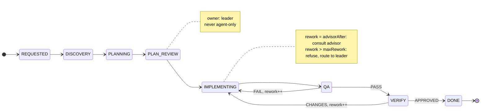
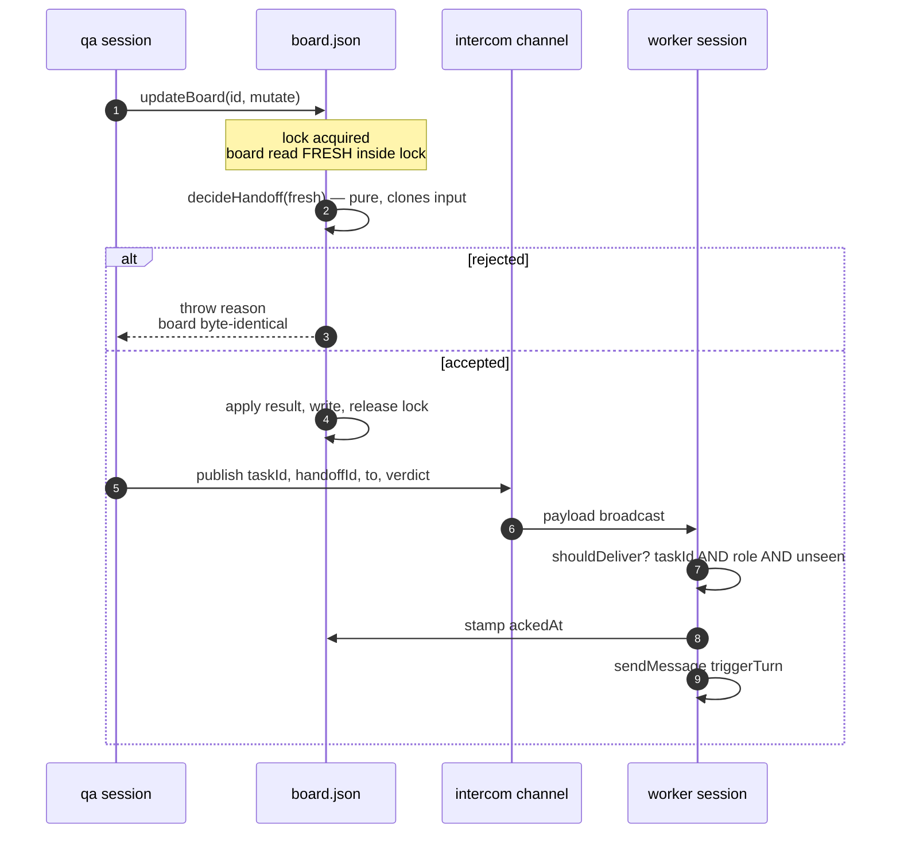

[Index](architecture.md)

# 5. Handoff protocol

A handoff is the **only** operation that advances the task. Consulting a
researcher or advisor is not a handoff; neither is asking a question, reporting
progress, or writing a checkpoint.

## 5.1 The phase machine

The `feat` workflow, which exercises every construct:



Ownership per phase is configuration, not code. `owner` is read from the
workflow, so `TARGETED_QA` and `REGRESSION_QA` require no special handling
anywhere in the protocol — a fact worth stating because the obvious
implementation (matching on phase *names* to decide whether a rework occurred)
would need a case for each.

## 5.2 Pure decision, effectful commit

```ts
decideHandoff(input: HandoffInput): HandoffDecision   // pure
```

`decideHandoff` performs no I/O and reads no clock: `now` and `handoffId` are
supplied by the caller. It `structuredClone`s the input board and returns a new
one, leaving its argument untouched.

This split is what makes the protocol testable. Fifteen unit tests drive the
reducer directly with hand-built boards — including the escalation and
attribution logic, which would otherwise require orchestrating several live
sessions to observe.

The cost of purity is a discipline at the call site: the caller must write the
returned board back. That discipline failed once — see
[7.2](verification.md#72-three-defects-that-passed-a-green-suite), defect 2.

## 5.3 Decision order

| # | Step | On failure |
|---|---|---|
| 1 | **Resolve target.** `leader` → persisted leader session; else `sessions[to]` | reject, listing the roster |
| 2 | **Liveness.** target present in the live roster | reject, naming the session |
| 3 | **Verdict validation.** `qa ⊢ PASS｜FAIL`, `verifier ⊢ APPROVED｜CHANGES`, others ⊢ ∅ | reject, naming the allowed set |
| 4 | **Rework accounting.** `verdict ∈ {FAIL, CHANGES} ∧ to = worker` → increment | — |
| 5 | **Advisor escalation.** `rework ≥ advisorAfter ∧ lastConsulted < rework` | attach directive |
| 6 | **Rework bound.** `rework > maxRework` | reject, routing to leader |
| 7 | **Checkpoint warning.** no checkpoint for sender's current epoch | attach warning, never blocks |
| 8 | **Transition.** apply phase, owner, spec, history | — |

### Notes on individual steps

**Step 1 — `leader` is a first-class destination.** The leader is never in the
roster (it is the operator's own session), so a naive roster check rejects the
single most important handoff in a `feat` workflow: planner → leader for
`PLAN_REVIEW`. It is resolved from `board.leader.sessionName`.

**Step 2 — liveness precedes commit.** The board is never permitted to name an
owner that cannot receive. Without this, a handoff to a closed pane would leave
the task recorded as owned by a session that will never act, with no error.

**Step 3 is validation, not enforcement.** The verdict *vocabulary* is checked;
whether a `PASS` was deserved is not. This is the boundary between schema
concerns and workflow concerns, and it is deliberately drawn tightly.

**Step 4 counts by verdict, not by phase name.** Per spec when the workflow is
spec-driven, per board otherwise. Two subtleties:

- An empty-string spec id must not be treated as truthy. `input.spec && specs[input.spec]`
  evaluates to `""`, and `"".reworkRound++` is a **silent no-op** — rework
  counting simply stops, with no error. Selection is keyed off
  `resolved.specs`, and the empty-string case has a dedicated regression test.
- Per-spec counting matters even without parallelism: `s02` failing twice must
  leave a fresh `s03` at zero, or the next spec starts pre-escalated.

**Step 5 re-fires.** The condition is `≥`, not `==`, and is gated on
`lastAdvisorConsultedRound < reworkRound`. A one-shot `==` nudge that the worker
ignored would never fire again.

### Transition semantics (step 8)

```
phase       ← input.phase
owner       ← phaseOwner(resolved, input.phase) ?? input.to
currentSpec ← input.spec ?? currentSpec
history     += { handoffId, from, to, spec, phase, verdict, sentAt }   // ackedAt unset
```

Nothing else changes. The phase's configured owner wins over the destination —
they differ whenever a role hands *to* someone for a phase owned by a third
role. An unknown phase name falls back to the destination rather than throwing,
because a workflow may legitimately be extended.

> **I3 (Rejection immutability).** A rejected handoff leaves the board
> byte-identical. Asserted by deep-equality against a pre-call snapshot.

## 5.4 Delivery and acknowledgement



**Ordering is deliberate.** The decision is computed *inside* the serialised
mutation, against a freshly-read board; the commit completes before the publish.
Publishing first would let a receiver act on a handoff that never committed.

### The receiver's predicate

```ts
shouldDeliver({ payload, myTaskId, myRole, seenHandoffIds }): boolean
```

Pure and total — a malformed payload returns `false` rather than throwing.
Delivery requires **all three**:

| Condition | Necessary because |
|---|---|
| `taskId` matches | the channel is broadcast; concurrent tasks coexist |
| `to` = own role | every crew member receives every payload |
| `handoffId` unseen | `resume` deliberately republishes unacknowledged handoffs |

The third is the subtle one and it is a direct coupling to
[lifecycle](consistency.md): because `resume` republishes, a legitimate
duplicate *will* arrive, and must be suppressed rather than double-delivered.
Removing either half — republishing unconditionally, or de-duplicating loosely —
breaks the other.

### Acknowledgement

On delivery the receiver stamps `ackedAt` on the matching history entry and
injects the message as a real turn. An unacknowledged record is therefore an
**observable, recoverable** condition: `status` reports it, and `resume`
republishes it.

This is the cheap half of a two-stage acknowledgement protocol that was
considered and declined. The full version added a `HANDOFF` pseudo-phase and
pending state to detect a rare failure; stamping on injection and refusing
upfront when the target is not live yields the same information for three lines.

## 5.5 Escalation

The worker/qa cycle is the only cycle in the protocol, and it is bounded twice.

```
rework 0 ──► 1 ──► 2 ──────────► 3 ──────────► 4
                  │              │             │
                  advisorAfter   still nudges  maxRework
                  → consult      → consult     → refuse, route to leader
```

- At **`advisorAfter`**, the delivered message gains: *"Rework N. Stop guessing:
  checkpoint, then consult the advisor with your failed attempts and the qa
  evidence."* Advisory.
- At **`maxRework`**, the handoff is refused and the caller is told to hand to
  the leader. **This is the only enforcement in the system.**

The asymmetry is intentional. Phases, ownership and sequence are all advisory —
an agent may hand off out of order and the system records what happened rather
than preventing it. But an unbounded retry loop between two automated agents
consumes budget without converging, and produces no signal that it is failing.
That is the one outcome not left to judgement.

### 5.5.1 Attribution

> A verdict caused entirely by files outside the spec's write scope is
> `BLOCKED`, not `FAIL`, and must not increment the counter.

This rule was derived empirically rather than designed. During construction, a
repository-wide verification gate produced a failing verdict against an agent
whose own scope was clean — the failure was in a sibling's files. Had that
counted as rework:

1. the agent would have been escalated to the advisor for a defect it could not
   see, wasting an `xhigh` consultation on a false premise;
2. and at `maxRework` it would have been refused entirely, for someone else's
   bug.

**Generalisation: counters that drive escalation must be attributable to the
unit under review.** A gate whose scope is wider than the unit it judges will
produce unattributable failures, and an unattributed counter converts them into
punishment.

`Expected Write Scope` on the spec ([4.3](crew.md#43-specs)) is what makes
the attribution decidable.

