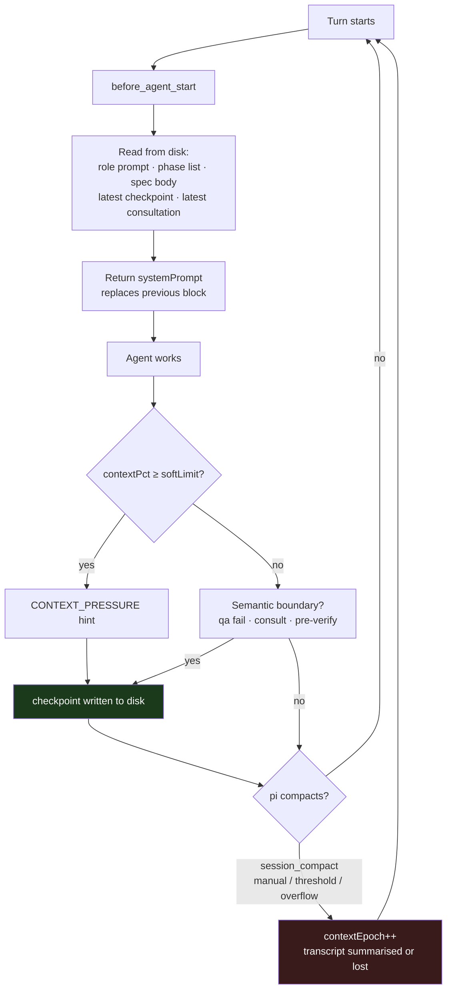

[Index](architecture.md)

# 2. L-Thread

## 2.1 Definition

An **L-Thread** is the logical thread of work for one role R on one task T,
spanning the sequence of epochs E₁…Eₘ across every session that realises R.

```
L-Thread(worker, T)
├── S₁ ── e0 ──┬── e1 ──┬── e2      (compaction, compaction)
│              ⤓        ⤓
│           C(e0)    C(e1)          checkpoints written to disk
└── S₂ ── e3                        session restarted; reads C(e1)
```

Continuity across an epoch boundary is **not** provided by conversation history.
It is provided by *reconstruction*: at every turn the system re-derives what R
needs from durable state and injects it.

## 2.2 Reconstruction, not retention

On each turn, if `BLANCHE_ROLE` and `BLANCHE_TASK` are set, the extension
assembles a block from disk:

| # | Section | Source | Omitted when |
|---|---|---|---|
| 1 | Role prompt | `roles/{role}.md` | never |
| 2 | Phase sequence, current marked, owner per phase | `board.resolved.phases` | never |
| 3 | Board summary — task, phase, owner, spec, rework, epoch | `board.json` | never |
| 4 | Current spec body | `specs/{spec}.md` | workflow is not spec-driven |
| 5 | Latest checkpoint for (role, spec) | `sessions[role].latestCheckpoint` | none written yet |
| 6 | Latest advisor consultation for the spec | `consultations/c-*.md` | none recorded |
| 7 | Peer session names | `board.sessions` | never |
| 8 | `CONTEXT_PRESSURE` hint | roster `contextPct` vs `softLimit` | below the limit |

### Separation of reading from rendering

```ts
buildCrewBlock(input: {
  role, board, rolePrompt,
  specBody?, checkpoint?, consultation?,
  contextPct?, softLimit, peers,
}): string
```

`buildCrewBlock` performs **no I/O**. All file content arrives as parameters;
`index.ts` does every read. Two reasons:

1. **Testability.** The assembly is a pure function of its inputs, so ordering,
   omission and the pressure threshold are unit-testable with no filesystem.
2. **One read policy.** Every decision about *which* checkpoint, *which*
   consultation, and what to do when a file is missing lives in one place
   rather than being distributed through a renderer.

An earlier revision required the renderer to include the spec body but provided
no parameter for it, which would have forced a file read inside a function
documented as pure. The signature was corrected rather than the documentation.

### Ordering is fixed

Peers are sorted; sections always appear in the order above. A stable block
keeps the provider's prompt cache warm across turns — an unstable one would
invalidate the cached prefix on every turn, which is a direct cost multiplier.
This is asserted by a regression test that renders the same input twice with a
shuffled peer array and requires byte-identical output.

## 2.3 Ephemerality of the injected block

The block is returned as `{ systemPrompt }` from `before_agent_start`. This is
load-bearing, and rests on a property of the host verified against source:

> pi stores an extension-returned system prompt in `_systemPromptOverride`
> (`agent-session.js:902`) and **resets it to `undefined` on any turn where no
> extension returns one** (`agent-session.js:907`). It is never appended to the
> message history.

### Why the alternative fails

Had the block been delivered as a message instead:

| Turn | As `systemPrompt` | As a message |
|---|---|---|
| 1 | 1 copy, current | 1 copy |
| 50 | 1 copy, current | 50 copies, 49 stale |
| after compaction | 1 copy, current | summariser must decide which copies matter |

The mechanism intended to *survive* compaction would have become the dominant
consumer of the context it was protecting, and would have fed the summariser
fifty contradictory snapshots of the same board.

> **I2 (Freshness).** The phase, spec and checkpoint an agent reads are those
> current at the start of its turn.

## 2.4 The turn cycle



The epoch boundary (red) **has no handler**. Because step C runs on every turn,
the first turn of a new epoch is briefed identically to any other turn — from
disk, including the checkpoint written at step I (green).

## 2.5 Checkpoints

```ts
checkpoint({ completed, decisions, failedApproaches, currentFailures,
             validation, filesChanged, remaining, nextAction })
```

Written to `checkpoints/{spec|task}-{role}-e{epoch}.md`. Empty sections are
omitted rather than rendered blank, so a sparse checkpoint reads as a short
document rather than a form with unfilled fields.

### Field rationale

| Field | Why it is worth durable storage |
|---|---|
| `completed` | Prevents redoing finished work. Cheap to record, expensive to re-verify. |
| `decisions` | A choice already made and its reason. Without it, a successor re-opens settled questions. |
| **`failedApproaches`** | The highest-value field. Each entry is `{approach, result, whyItFailed}` — a negative result plus its cause. |
| **`currentFailures`** | What is failing *right now*, verbatim. Distinguishes "not yet attempted" from "attempted and still broken". |
| `validation` | What has actually been **proven** — *"targeted spec passes, full suite not run"*. Separates demonstrated from assumed correctness. |
| `filesChanged` | Orients a successor in the working tree without a diff. |
| `remaining` | The residual plan, scoped to the current spec. |
| `nextAction` | The single next step. Removes the restart cost of deciding where to begin. |

### What is deliberately not captured

Raw tool output, successful command logs, superseded diffs, and full file
contents. All are cheap to regenerate and would dilute the record. The
asymmetry is intentional: **the checkpoint stores what is expensive to
rediscover, not what is expensive to display.**

`validation` deserves emphasis. Without it, a successor inherits a claim of
completion with no indication of its strength, and either re-runs everything or
trusts too much. Recording *"targeted spec passes, full suite not run"* is what
lets the next epoch make that choice deliberately.

## 2.6 Checkpoint boundaries

Checkpoints are triggered by **semantic** events, not solely by context
pressure:

- after plan approval,
- before handing to qa,
- after every qa failure,
- after an advisor consultation,
- before the verifier,
- after a substantial subtask,
- and whenever context pressure says so ([3](compaction.md)).

A purely pressure-driven policy would checkpoint when the context is nearly
exhausted — simultaneously the least reliable moment to demand well-structured
output, and not necessarily a moment at which the work is in a coherent state.
An agent 90% through a refactor produces a worse checkpoint than the same agent
immediately after a qa failure, when the failure is concrete and fresh.

Pressure is therefore a *backstop*, and the semantic boundaries are the primary
mechanism.

