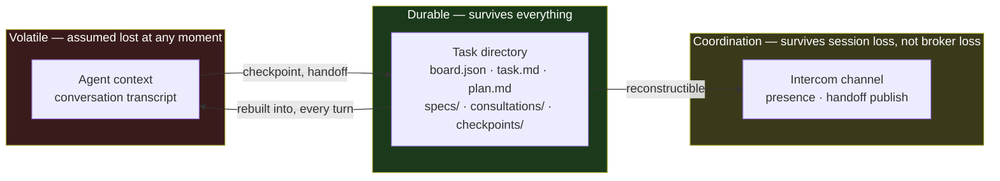

[Index](architecture.md)

# 1. The model

## 1.1 Problem statement

Let a task **T** require work whose transcript length exceeds the usable context
of a single agent session **S**. Three properties are desirable:

- **P1 — Durability.** Progress on T survives the destruction of any S.
- **P2 — Continuity.** A replacement session S′ resumes without rediscovering
  what S already established, *including negative results*.
- **P3 — Division of labour.** Distinct sub-problems of T may be assigned to
  differently-capable agents without losing a coherent view of T.

## 1.2 Why summarising compaction is insufficient

Compaction addresses P2 partially and P1 not at all. Three distinct failures:

**It is lossy by construction.** A summary is smaller than its input; something
is discarded. That is the point of it.

**It is *unpredictably* lossy.** The operator cannot state in advance which
facts survive. A mechanism whose failure mode cannot be predicted cannot be
designed around — the only safe assumption is that any given fact is gone,
which is equivalent to having no mechanism.

**It discards exactly the wrong facts.** A summariser optimises for narrative
continuity, so it preserves what happened and drops what *didn't work*. But a
negative result is the most expensive class of knowledge in a debugging task:

> *"Redis lock around the controller; the race happens before the lock is
> acquired."*

That sentence costs an hour to produce and is worth an hour to the next agent.
A summariser reads it as an abandoned dead end and removes it. The successor
then re-derives it at full price — and, having no record, may do so repeatedly.

**Consequence.** Any mechanism that stores continuation state *inside* the
artefact being compacted inherits all three failures. Continuation state must
live somewhere compaction cannot reach.

## 1.3 Entities

| Symbol | Entity | Lifetime | Authoritative? |
|---|---|---|---|
| T | Task | days; bounded by explicit deletion | — |
| B | Board — runtime state of T | = T | **yes** |
| R | Role (7 of them) | = T | no |
| S | Session — one OS process, one agent, one role | minutes–hours | no |
| E | Epoch — interval of S between compactions | minutes | no |
| C | Checkpoint — continuation state for (R, spec, E) | = T | **yes** |

A role R is *realised* by a sequence of sessions S₁…Sₙ, each passing through
epochs E₁…Eₘ. Neither S nor E is authoritative for any fact about T. This is the
substitution that makes the rest of the design possible: **a role is a durable
position; a session is a replaceable occupant of it.**

## 1.4 State partition

All state is exactly one of three kinds.



| Kind | Contents | Survives | Recovery |
|---|---|---|---|
| **Durable** | task directory | everything short of disk loss | — |
| **Coordination** | intercom channel state, presence, in-flight publishes | session loss; **not** broker restart | rebuilt from durable state by `resume` |
| **Volatile** | agent context, tool results, reasoning | nothing | not recovered; *reconstructed* |

Arrows into the durable layer are the only ones that persist information.
Everything flowing outward is a projection that may be destroyed at any time.

> **I1 (Durability).** No fact required to continue T is stored only in volatile
> state.

### The operational test for I1

> *If every pi transcript were deleted right now, could `/crew resume`
> reconstruct enough truth for each role to continue correctly?*

This is an acceptance criterion, not a slogan — it is the shape of a test that
can actually be run: delete the session files mid-task, resume, and observe
whether each role continues coherently.

## 1.5 The task directory

```
~/.pi/agent/pi-blanche/tasks/<id>/
  board.json        runtime state; references, never long-form content
  task.md           original requirement and constraints, verbatim
  plan.md           approved plan narrative
  specs/            s01-*.md … one file per independently verifiable unit
  consultations/    c-*.md … distilled advisor conclusions
  checkpoints/      {spec|task}-{role}-e{epoch}.md
```

### Why the board holds references, not content

`board.json` is rewritten under a lock on every mutation ([6](consistency.md)).
Two consequences follow from keeping it small:

1. **The critical section stays cheap.** A board that inlined plan text and
   checkpoint bodies would be tens of kilobytes rewritten on every epoch
   increment and every acknowledgement stamp.
2. **Content is addressable independently.** A checkpoint can be read by a role
   that is not the one mutating the board, with no lock and no coordination.

The cost is that a reader must perform two reads — board, then referenced file —
and that a referenced file can in principle be missing. Both readers guard with
an existence check and degrade to omitting the section.

### Path convention

Every path recorded on the board is **relative to the task directory**:
`checkpoints/s02-worker-e1.md`, `consultations/c-a21f.md`. Readers join
`taskDir(id)` with the stored value.

This convention is stated explicitly because violating it is silent. An earlier
implementation stored the absolute path returned by the writer, so the reader's
join produced a doubled path, the existence check failed, and the consultation
was simply never injected — no error, no log, just a section quietly missing
from every prompt thereafter.

## 1.6 What is deliberately *not* modelled

- **No cross-machine state.** Broker and task directory are local.
- **No task hierarchy.** Tasks do not have subtasks; they have specs, which are
  flat and belong to exactly one task.
- **No agent identity across tasks.** A worker in task A shares nothing with a
  worker in task B beyond its configuration.
- **No history compaction.** The board's `history` array grows without bound.
  At observed handoff rates (tens per task) this is not worth managing.

